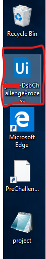
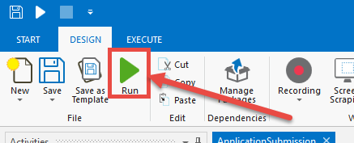
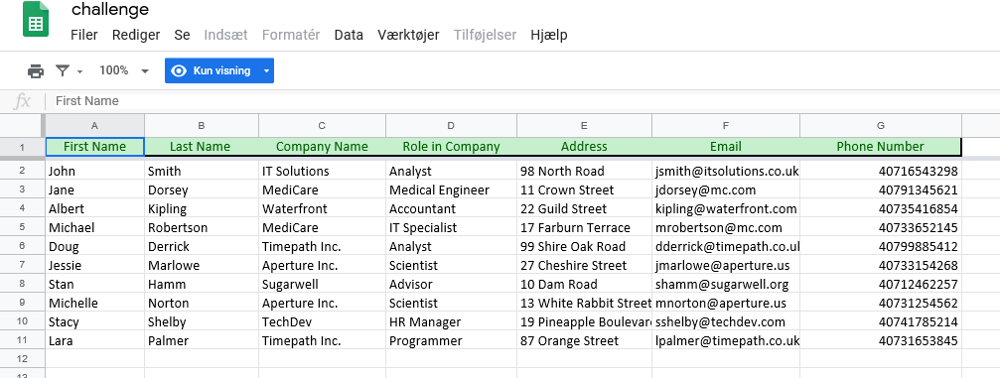
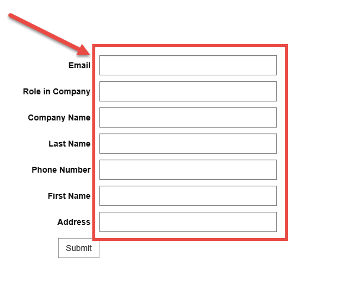
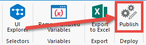
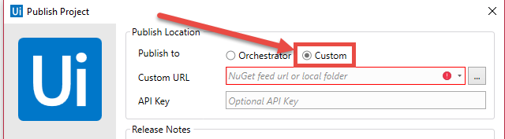

# DSB RPA Applicant Challenge

## Overview

Within this 2-hour window, we have included the following tasks:

1. Completion of a described RPA process using a skeleton workflow
2. Submission of your workflow as instructed by this guide

## Why do a Challenge?

As a part of our RPA developer applicant assessment process, we have decided to include a robotics challenge. Here is what we hope to gain from this exercise:

- Greater insight into the way you work.
- A concrete example of your work we can discuss in the in-person interview.

The challenge is not meant to cause extra stress or take up too much of your time; instead we hope it is a time for you to exhibit your skills and know-how.

## Accessibility

At DSB, we care about equal accessibility for all. We should have already provided you the chance to let us know about any accommodations that you need for the challenge. Here we want to reiterate that you still have the chance to make requests for accommodation. Just contact Nathan to do so (contact info below).

## Technical Problems & Support

You are completing the challenge on resources provided by us, so we take the responsibility for malfunctions and/or complications. If you have any problems, ring or send an email to Nathan Kuik, who has pre-arranged this period for you to complete the challenge.

- Telephone: +45 24 68 50 90
- Email: [naku@dsb.dk](mailto:naku@dsb.dk)

## **Remember!**

Your VM will, without warning, shutdown at the end of the pre-arranged window, so please ensure you leave time to submit your workflow!

## Process Description

For this exercise, you are asked to read data from a spreadsheet in a browser and input the data into a web form on a different website. The workflow you have been provided with includes the opening of the spreadsheet (where the data is read) within a single browser window, as well as the opening of the web form in a second browser window (where the data is input).

There are 10 lines of data that should be read from the spreadsheet and each row of data should be input in the web form in the order of the rows of the spreadsheet. The web form should be submitted after each row’s information is submitted.

The steps of the process can be listed like this:

1. Open the browser window of the spreadsheet to read data from (already included in the workflow).
2. Open the browser window of the web form to input the data (already included in the workflow).
3. Read a row of data from the spreadsheet.
4. Input the data in the corresponding fields in the webform.
5. Submit the form.
6. Repeat the steps above for each row of data in the spreadsheet.

## Directions

1. Open the workflow (.xaml file with the “Ui” icon) from your desktop (double-click):

2. Test the workflow by hitting “Run” or F5 to ensure two web browser windows are opened:

3. Close the Internet Explorer windows just created
4. Complete the code to read data from the rows of the spreadsheet:

5.Input the data for each row from the Google sheet in the corresponding fields in the rpachallenge.com site (Read “Notes” below for more details):

 
**Notes**: The directions on the rpachallenge.com site are the same as what we want you to accomplish—BUT we are using a spreadsheet from a browser instead of the file located on the site, but all the values are the same.
You can test your workflow as many times as you’d like. Ensure that the web form is refreshed, because the web form expects the values as they are ordered on in the spreadsheet.

## Submit Challenge

When you are ready to submit the challenge, please follow these directions:

1. Save you workflow (ctrl-s)
2. Select “Publish” within UiPath Studio:

3. Select “Custom” from the publish option:

 
4. From the dropdown, select: https://dsbcp.pkgs.visualstudio.com/_packaging/ApplicantSubmissions/nuget/v2
5. Type your name in the “API Key” field.
6. Select “Publish”:
 

7. Ring to Nathan (+45 24 68 50 90) to confirm your submission

## Checklist

Ensure that you have:

- [ ] Completed the pre-challenge questionnaire
- [ ] Completed the RPA challenge as best you could
- [ ] Published your workflow
- [ ] Ring to Nathan (+45 24 68 50 90) to confirm your submission

## Thanks!

On behalf of DSB, we’d like to thank you for your time and effort spent on this task. It will greatly assist us in finding the best match for the position.